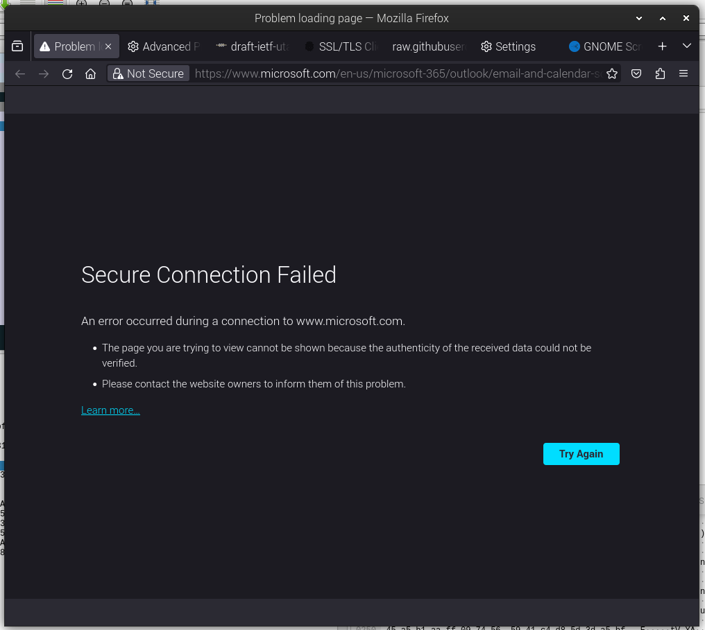

# Unable to connect Outlook with strong encryption
If I try to open https://www.microsoft.com/en-us/microsoft-365/outlook/email-and-calendar-software-microsoft-outlook with following parameters, it wll fail:

```
Cipher Suites (9 suites)
    Cipher Suite: TLS_CHACHA20_POLY1305_SHA256 (0x1303)
    Cipher Suite: TLS_AES_128_GCM_SHA256 (0x1301)
    Cipher Suite: TLS_AES_256_GCM_SHA384 (0x1302)
    Cipher Suite: TLS_ECDHE_ECDSA_WITH_AES_128_GCM_SHA256 (0xc02b)
    Cipher Suite: TLS_ECDHE_RSA_WITH_AES_128_GCM_SHA256 (0xc02f)
    Cipher Suite: TLS_ECDHE_ECDSA_WITH_CHACHA20_POLY1305_SHA256 (0xcca9)
    Cipher Suite: TLS_ECDHE_RSA_WITH_CHACHA20_POLY1305_SHA256 (0xcca8)
    Cipher Suite: TLS_ECDHE_ECDSA_WITH_AES_256_GCM_SHA384 (0xc02c)
    Cipher Suite: TLS_ECDHE_RSA_WITH_AES_256_GCM_SHA384 (0xc030)
```

